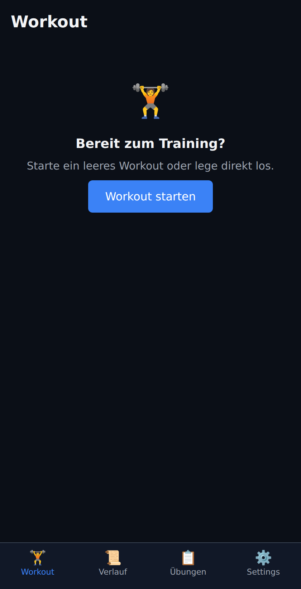
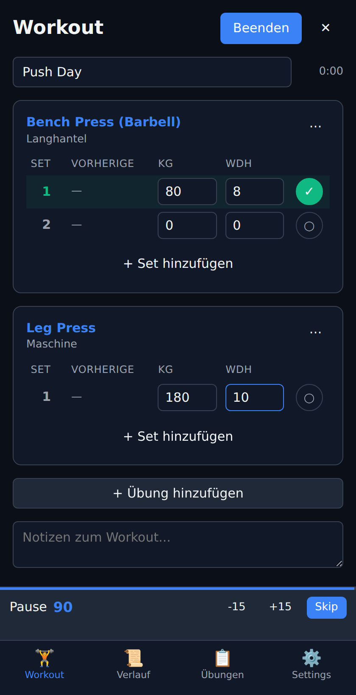
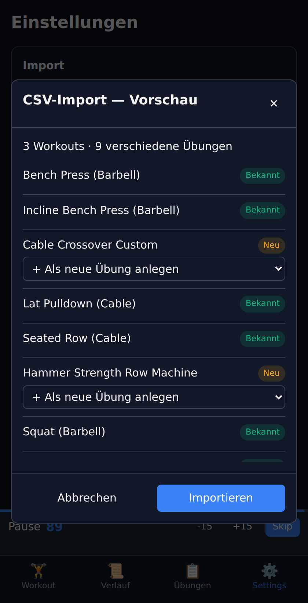
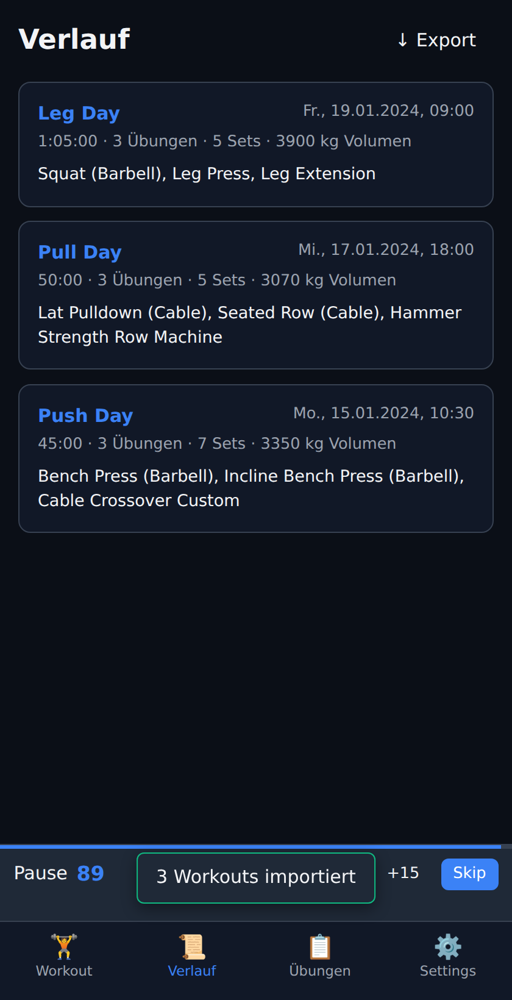
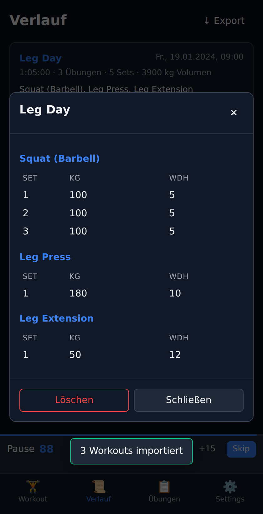
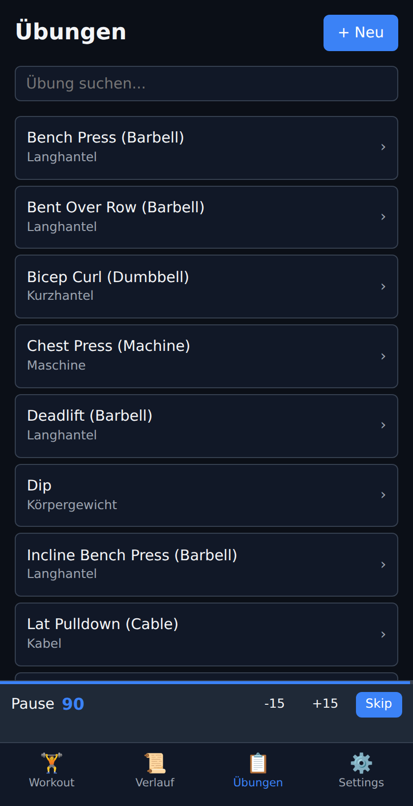

# Fitness Tracker

Lokale Fitness-Tracker-App. Keine Server, keine Accounts — alle Daten liegen im LocalStorage des Browsers.

## Screenshots

| | | |
|---|---|---|
|  |  |  |
| Startbildschirm | Aktives Workout + Ruhetimer | CSV-Import-Vorschau |
|  |  |  |
| Verlauf nach Import | Workout-Detail | Übungs-Bibliothek |

## Features

- **Workouts tracken**: Übungen hinzufügen, Sets mit Gewicht & Wiederholungen abhaken
- **Ruhezeit-Timer**: startet automatisch nach jedem abgehakten Set (mit Sound + Vibration)
- **Übungs-Bibliothek**: Maschinen, Langhanteln, Kabel etc. anlegen und kategorisieren
- **Verlauf**: alle abgeschlossenen Workouts mit Volumen & Dauer
- **CSV-Import** (Strong-App-Format): unbekannte Übungen werden in einer Vorschau angezeigt — du kannst sie entweder neu anlegen oder auf eine vorhandene Übung mappen
- **CSV-Export**: gleicher Strong-kompatibler Spalten-Aufbau
- **JSON-Backup**: vollständiger State exportier-/importierbar

## Lokal starten

```bash
cd fitness-tracker
python3 -m http.server 8000
# oder
npx serve .
```

Dann `http://localhost:8000` öffnen.

## Strong-CSV-Spalten

Erwartete Header (case-insensitive, Whitespace/Unterstrich/Bindestrich werden normalisiert):

```
Date, Workout Name, Duration, Exercise Name, Set Order,
Weight, Reps, Distance, Seconds, Notes, Workout Notes, RPE
```

Mindestpflicht: `Date` und `Exercise Name`. Alles andere ist optional.

## Übungen fehlen?

Beim Import zeigt die Vorschau jede unbekannte Übung an. Pro Zeile kannst du:

- **Neu anlegen** (default — Kategorie `Sonstiges`, später editierbar)
- **Auf existierende Übung mappen** (Dropdown)

Alternativ: außerhalb der App im Chat sagen, welche Maschinen/Übungen fehlen — ich kann dir helfen, die passenden Einträge anzulegen (Kategorie, Ruhezeit, Notizen).

## Stack

Vanilla HTML/CSS/JavaScript, kein Build-Step, keine Dependencies. LocalStorage als Datenbank.
